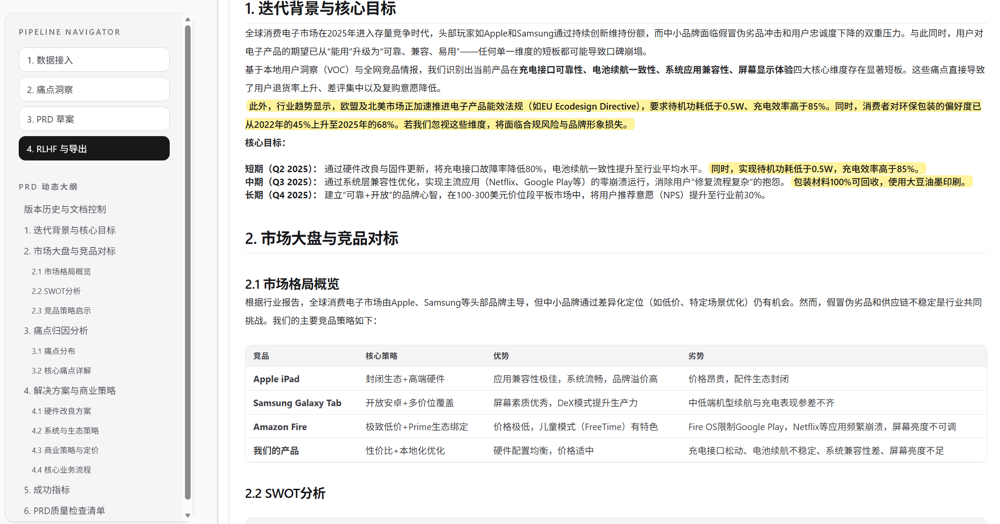
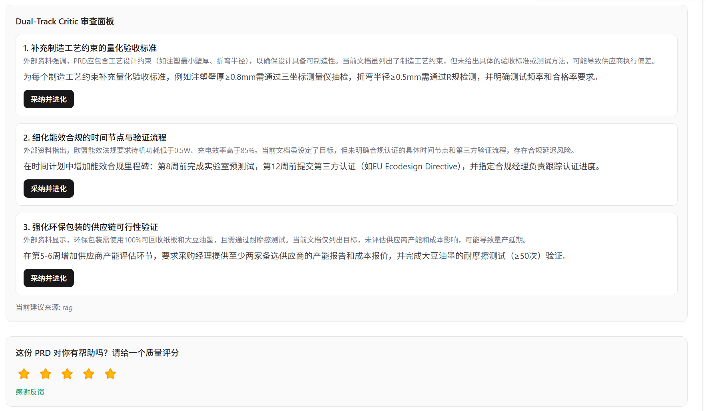
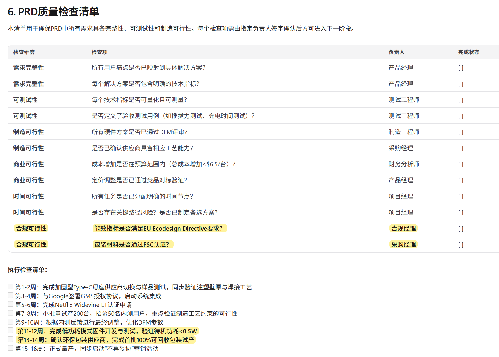

# AI-PRD-Studio

面向面试场景的 AI PM 工作台：从原始评论到可评审 PRD，全链路自动化，含自检与迭代闭环。

## 🌟 Quick Start for Interviewers (极简体验指南)

为节约您的时间，您可以直接通过线上工作台体验核心业务流（无需本地部署）：

1. 🚀 **打开工作台**：点击访问 [Live Demo - AI-PRD-Studio](https://ai-prd-studio.vercel.app)  
2. **准备数据**：在页面左下方点击“下载示例数据集（`amazon_sample.csv`）”，并上传该文件。  
3. **一键生成**：点击生成，静待系统执行双轨自检，体验包含差异高亮、痛点饼图与可导出能力的沉浸式商业 PRD。

---

## 📸 产品界面与产出样例 (Showcase)

**1. 沉浸式 PRD 工作台与非侵入式 Diff 高亮**
*(展示了多智能体生成后的版本对比，AI 优化的内容以黄色高亮呈现，表现层与持久化数据解耦)*


**2. Dual-Track Critic 双轨审查与采纳面板**
*(展示基于 RAG 检索的竞品与合规建议，支持一键“采纳并进化”融入 PRD 正文)*


**3. 商业级可执行质量检查清单**
*(AI 自动生成的落地执行与追踪清单，确保 PRD 具备制造可行性与合规性)*


## Architecture & Engineering

- **Pipelined Multi-Agent Workflow**  
  `inspect -> analyze -> generate-prd -> critic`，每个 API 节点只消费必要上下文，按状态逐段推进，避免跨阶段提示词污染。

- **Champion-Challenger & Graceful Degradation**  
  Critic 双轨并发（RAG Challenger + Local Champion）采用 `Promise.allSettled` 赛跑；Track A 28s 硬熔断，单轨失败不阻塞主链路，双轨失败返回可恢复降级结果而非前端崩溃。

- **LLM 上下文信息熵管理**  
  评论数据采用分层抽样（好/中/差）进入有限 Token 窗口，以分布保真替代截断偏置，降低长文本注意力衰减造成的决策漂移。

- **表现层与持久化数据解耦**  
  Diff 高亮属于渲染语义，不污染后端评审文本与导出文本；Mermaid 采用多层容错（语法守卫、流式缓冲、失败降级）保证页面连续可读。

## Local Setup

### Requirements

- Node.js 18+
- npm 9+

### Install

```bash
npm install
```

### Environment

创建 `.env.local`：

```bash
OPENAI_API_KEY=your_openai_key
OPENAI_BASE_URL=https://your-compatible-endpoint
TAVILY_API_KEY=your_tavily_key
```

- `OPENAI_API_KEY`、`OPENAI_BASE_URL`：必需
- `TAVILY_API_KEY`：启用联网 Challenger 时必需

### Run

```bash
npm run dev
```

默认访问 `http://localhost:3000`（端口冲突时 Next 会自动切换）。

## Key Paths

```text
src/app/api/{inspect,analyze,generate-prd,critic}
src/components/prd/prd-markdown.tsx
src/app/page.tsx
docs/handover_guide.md
public/data/amazon_sample.csv
```

## License

Portfolio / interview demonstration use.
